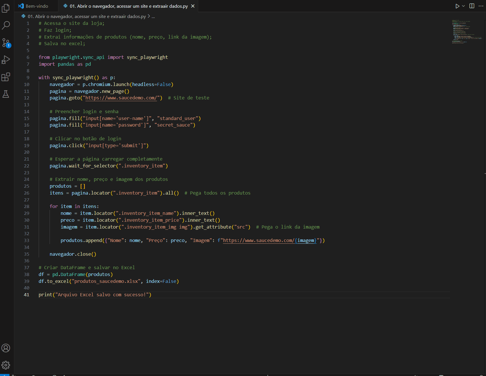

# Bot de Coleta Automatizada de Produtos com Login Seguro

Este bot realiza login automático em um site com autenticação e coleta informações de produtos (nome, preço e imagem), salvando tudo em um arquivo Excel estruturado.  
Ideal para monitoramento de catálogos, comparação de preços ou atualização periódica de bases de dados comerciais.

## Problema que resolve
Coletar informações de sites com login manual é trabalhoso e repetitivo, especialmente quando há centenas de produtos.  
Este bot elimina a necessidade de acessar manualmente, navegar por páginas e copiar informações, economizando tempo e esforço.

## Solução implementada
- Login automatizado com autenticação de usuário
- Navegação por páginas com Selenium
- Extração de nome, preço e imagem de produtos
- Estruturação dos dados e exportação automática para planilha Excel

## Tecnologias
- Python
- Bibliotecas: `Selenium`, `pandas`, `openpyxl`

## Resultados
- Acesso e extração de mais de 100 produtos em menos de 1 minuto
- Eliminação de erro humano e aceleração no processo de atualização de planilhas

## Demonstração


## Como executar
1. Edite o script com as credenciais de login e o site alvo
2. Execute o arquivo principal:
```bash
python bot_login.py
